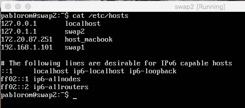
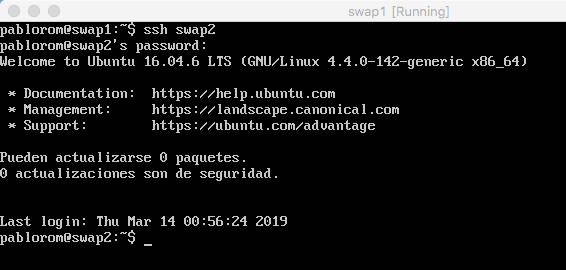
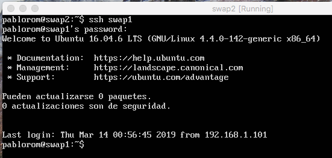
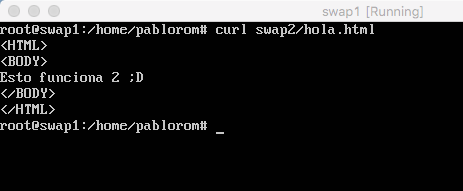
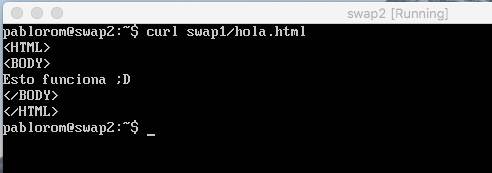
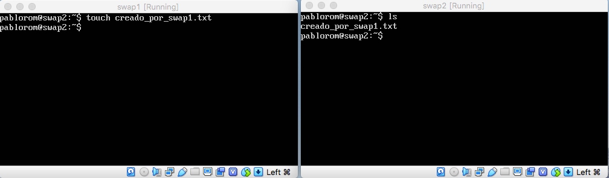

# SWAP - Práctica 1. Herramientas.

A continuación se detalla el proceso de instalación de dos ubuntu server como máquinas virtuales, todo lo referente a su configuración y correcto funcionamiento para conectarlos entre si mediante ssh.

Software utilizado:
  - VirtualBox 6.0
  - Ubuntu Server 16.04

Una vez instaladas las máquinas swap1 y swap2 se ha hecho un ping a google.es en cada una de ellas para comprobar que ambas tienen conexión. Tras esto se pasan a realizar las pruebas que se piden en el guión.

## Conectar ambas máquinas mediante ssh

**NOTA**
> En cada máquina se han creado alias para el host y para la otra máquina modificando el archivo hosts de cada una de ellas.

> Alias en el archivo hosts de swap1:

> Alias en el archivo hosts de swap2:

> Conexión de swap1 a swap2

>Conexión de swap2 a swap1

## Visualizar contenido de un archivo de una máquina a otra usando curl

En ambas máquinas se han creado dos ficheros html (distintos entre si) y se han alojado en el directorio /var/www/html. Consultaremos el contenido de estos ficheros html para comprobar así el correcto funcionamiento del servidor apache.

> Conexión mediante curl de swap1 a swap2

> Conexión mediante curl de swap2 a swap1

## Creación de fichero remoto mediante ssh (swap1 en swap2)
> La máquina swap1 está conectada a swap2 por ssh. En swap2 crea un fichero y desde swap2 comprobamos que se ha creado correctamente

