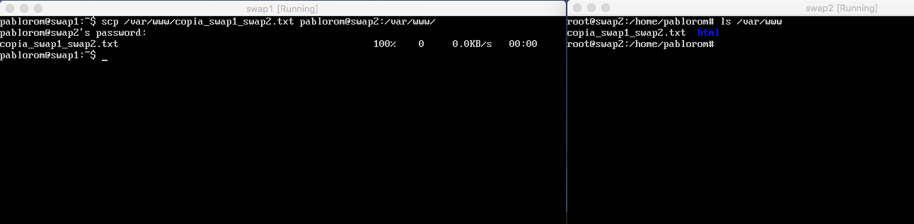
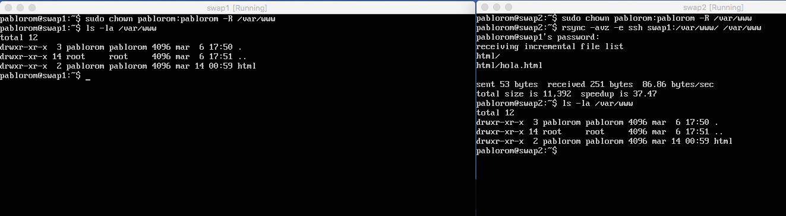
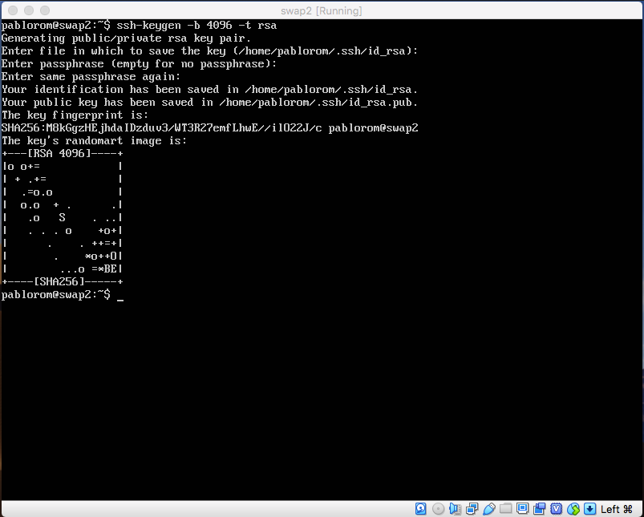
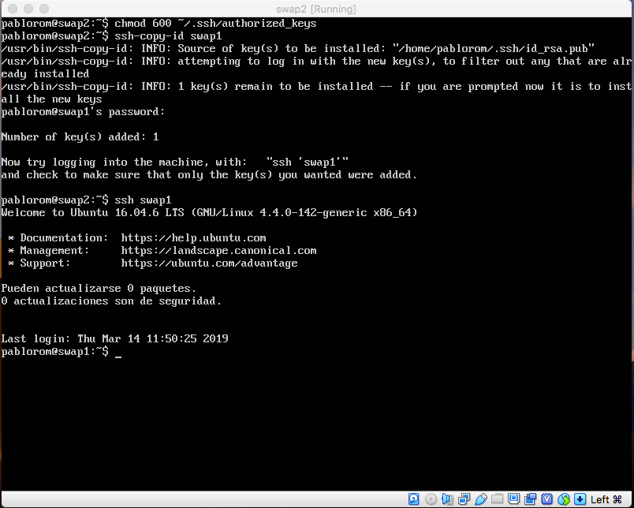
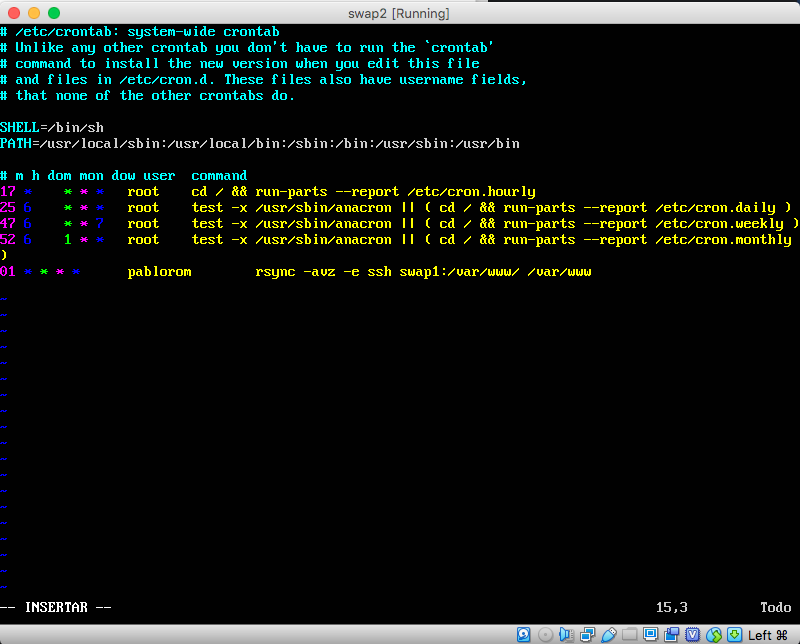
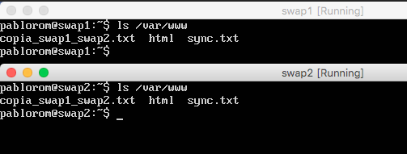

# SWAP - Práctica 2. Clonar información de un sitio web

A continuación se detalla el proceso para:
  - Configurar la copia de archivos mediante ssh
  - Clonar contenido entre máquinas
  - Acceder a máquinas remotas sin contraseña
  - Establecer tareas en cron para sincronizar el contenido de las máquinas.

## Copia de archivos entre máquinas mediante ssh

> Copia de archivos de swap1 a swap2 por ssh

> Clonado de una carpeta de swap1 a swap2 usando rsync

Para configurar el acceso a otra máquina sin que nos solicite contraseña debemos usar autenticación con un par de claves pública-privada.

> Usando ssh-keygen podemos generar la clave, con la opción -t para especificar tipo de clave.

Una vez que generamos las claves tenemos que copiarlas a la maquina a la que accederemos (swap1)

> Como podemos ver, ya se accede a la otra máquina mediante ssh sin que se solicite contraseña.

Para que las carpetas /var/www/ de ambas máquinas esten sincronizadas usaremos rsync, pero en lugar de tener que ejecutarla nosotros incluiremos esta orden en el archivo /etc/crontab donde especificaremos que ejecute la sincronización cada hora.

> Añadimos la linea con la orden rsync al archivo crontab

> En la imagen vemos como el archivo sync.txt (creado en swap1) se copia (sincroniza) en la segunda maquina (swap2). 
