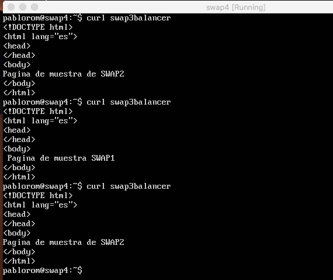

# SWAP - Práctica 3. Balanceo de carga.

A continuación se detalla el proceso para:
  - Configurar una máquina e instalar nginx como balanceador de carga
  - Configurar una máquina e instalar haproxy como balanceador de carga
  - Configurar los balanceadores con algoritmos round-robin y con ponderacion 
  - Someter a la granja web a una alta carga, generada por Apache Benchmark, tanto para gninx como para haproxy

## Configurar una tercera máquina como balanceador

Clonaremos una de las máquinas para crear nuestro balanceador web. La nueva máquina, llamada swap3balancer, tendrá acceso a las dos máquinas finales swap1 y swap2.

Instalaremos nginx con la orden:

```bash
pablorom@swap3balancer:~$ apt-get install nginx
```

También instalaremos haproxy:

```bash
pablorom@swap3balancer:~$ apt-get install haproxy
```

Una vez tengamos instalador los balanceadores los tenemos que configurar. En el caso de nginx modificaremos el fichero /etc/nginx/conf.d/default.conf y usaremos algoritmo de ponderacion dandole peso 2 a la maquina 2 (swap2) y 1 a la maquina 1 (swap1).


> Detalles del fichero de configuracion de nginx

Para configurar haproxy modificaremos el archivo /etc/haproxy/haproxy.cfg


> Detalles del fichero de configuracion de haproxy

Primero probaremos nginx. Para arrancarlo simplemente usamos la orden:

```bash
pablorom@swap3balancer:~$ systemctl start nginx
```

Ahora que está activo podemos hacer peticiones desde una cuarta máquina (swap4) y ver como habrá veces que muestre el contenido de una máquina y otras el de otra:


> Muestra de funcionamiento de gninx con peticiones sencillas

Ahora, para probar haproxy, tenemos que parar nginx y luego arrancar haproxy, para ello:

```bash
pablorom@swap3balancer:~$ systemctl stop nginx
pablorom@swap3balancer:~$ systemctl start haproxy
```

Ahora que está activo podemos hacer peticiones desde una cuarta máquina (swap4) y ver como habrá veces que muestre el contenido de una máquina y otras el de otra:


> Muestra de funcionamiento de haproxy con peticiones sencillas

Finalmente someteremos a la granja web a una alta carga usando Apache Benchmark (ab):

```bash
pablorom@swap3balancer:~$ ab -n 10000 -c 10 http://192/168.56.4/index.html
```

Con el uso de la herramienta htop veremos que el porcentaje de la CPU del balanceador (swap3balancer) será el máximo y en las dos máquinas finales se reparten las peticiones según el algoritmo de ponderacion (en caso de nginx) y round-robin en caso de haproxy:


> Muestra de funcionamiento de gninx con una alta carga usando Apache Benchmark


> Muestra de funcionamiento de haproxy con una alta carga usando Apache Benchmark


