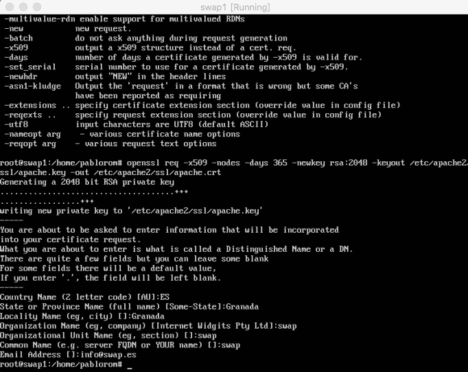

# SWAP - Práctica 4. Asegurar la granja web.

A continuación se detalla el proceso para:
  - Instalar un certificado autofirmado y configurar acceso HTTPS
  - Configurar el cortafuegos

## Instalar un certificado SSL autofirmado y cofigurar acceso mediante HTTPS

Para crear un certificado autofirmado tenemos que activar el modulo ssl de apache, para lo que ejecutaremos los siguientes comandos:

```bash
pablorom@swap1:~$ a2enmod ssl
pablorom@swap1:~$ service apache2 restart
```

A continuación generamos el certificado autofirmado con openssl:

```bash
pablorom@swap1:~$ mkdir/etc/apache2/ssl
pablorom@swap1:~$ openssl req -x509 -nodes -days 365 -newkey rsa:2048 -keyout /etc/apache2/ssl/apache.key -out /etc/apache2/ssl/apache.crt
```


> (Tendremos que especificar la ruta donde se almacenan los certificados)

Una vez tengamos nuestro certificado, añadimos la ruta de este al archivo de configuración de apache en el archivo default-ssl.conf


Tras esto, habilitamos el sitio por defecto default-ssl:

```bash
pablorom@swap1:~$ a2ensite default-ssl
pablorom@swap1:~$ service apache2 reload
```


Una vez terminada la configuración, tendremos habilitado apache para poder funcionar con peticiones https. A continuación haremos lo mismo en el resto de servidores de la granja web pero en lugar de generar nuevos certificados copiaremos el mismo certificado generado en la primera maquina (swap1) en el resto de maquinas.


Para terminar configuraremos el balanceador de carga (nginx) para que este también funcione con https. Para esto modificamos la configuración de nginx de la siguiente manera:


Con esto, toda la infraestructura de nuestra granja web queda configurada para funcionar con https.


> Ejemplo de funcionamiento de peticion http


> Ejemplo de funcionamiento de peticion https


> Ejemplo de funcionamiento de peticion https al balanceador


> Ejemplo de funcionamiento de peticion https al balanceador

## Configurar el cortafuegos

En esta práctica se usaran las *iptables* de linux como herramienta cortafuegos. En ellas especificaremos que conexiones se aceptan o rechazan.

A continuación se muestra el script creado en la maquina 2 (swap2) con todas las iptables:


> Script de iptables

Primero se eliminan todas las reglas que haya.
Luego se establecen las politicas por defecto (deniegan todo el trafico).
A continuación se permite acceso desde localhost.
En el siguiente bloque se abren los puertos 22 (ssh), 80 (http) y 443 (https).

Para que se ejecute el script al iniciar la máquina usaremos crontab:


> Añadimos a crontab la opción de ejecutar el script al hacer reboot

Y con esto tendríamos configurada nuestra granja web.


