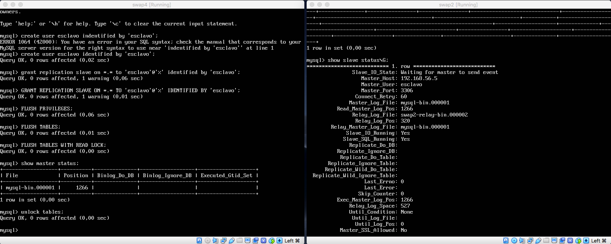
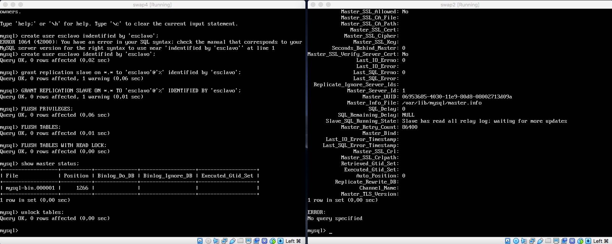
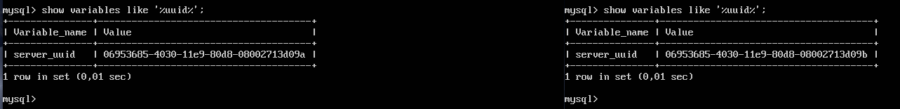
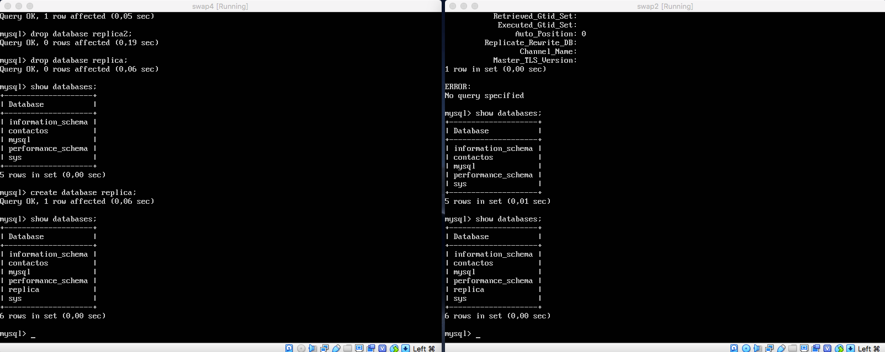

# SWAP - Práctica 5. Replicación de bases de datos MySQL.

A continuación se detalla el proceso para:
	- Crear una BD con al menos una tabla y algunos datos.
	- Realizar la copia de seguridad de la BD completa usando mysqldump en la
máquina principal y copiar el archivo de copia de seguridad a la máquina
secundaria.
	- Restaurar dicha copia de seguridad en la segunda máquina (clonado manual
de la BD), de forma que en ambas máquinas esté esa BD de forma idéntica.
	- Realizar la configuración maestro-esclavo de los servidores MySQL para que la replicación de datos se realice automáticamente.

## Crear una BD con al menos una tabla y algunos datos.

A lo largo de esta práctica se usará la interfaz de mysql:

```bash
pablorom@swap1:~$ mysql -u root -p

mysql> create database contactos;
mysql> use contactos;
mysql> show tables;
mysql> create table datos(nombre varchar(100),tlf int);
mysql> insert into datos(nombre,tlf) values ("pepe",95834987);
mysql> select * from datos;
```
Ya tenemos datos (un registro) insertados en la tabla datos de nuestra BD llamada "contactos".

## Replicar BD usando mysqldump

```bash
pablorom@swap1:~$ mysqldump contactos -u root -p > /root/contactos.sql
pablorom@swap1:~$ mysql -u root –p

mysql> FLUSH TABLES WITH READ LOCK; 
mysql> quit


pablorom@swap2:~$ scp swap1:/tmp/contactos.sql /tmp/
```

Una vez hecho esto, habremos copiado el fichero sql de la maquina1(swap1) a la maquina2(swap2).

Ahora que tenemos los datos en la máquina2, crearemos una BD para importar a esta los datos:

```bash
pablorom@swap2:~$ mysql -u root –p

mysql> CREATE DATABASE contactos; 
mysql> quit


pablorom@swap1:~$ mysql -u root -p contactos < /tmp/contactos.sql
```

## Replicar BD usando una configuración Maestro-Esclavo

Primero confifuraremos el maestro modificando el archivo /etc/mysql/mysql.conf.d/mysqld.cnf de la siguiente manera:

- Haremos que el servidor MySQL escuche una IP privada
- Asignaremos un ID servidor unico
- Habilitaremos el loging binario

```bash
pablorom@swap1:~$ sudo vim /etc/mysql/mysql.conf.d/mysqld.cnf

//maestro
bind-address           = 192.168.56.2
server-id              = 1
log_bin                = /var/log/mysql/mysql-bin.log

pablorom@swap1:~$ sudo systemctl restart mysql
```

Ahora crearemos un nuevo usuario para la replicación:
```bash
pablorom@swap1:~$ mysql -u root –p

mysql> CREATE USER 'esclavo'@'192.168.56.3' IDENTIFIED BY 'esclavo';
mysql> GRANT REPLICATION SLAVE ON *.* TO 'esclavo'@'192.168.56.3';
```

Comprobaremos ahora el estado del master:
```bash
mysql> SHOW MASTER STATUS\G
```

Y nos mostrará algo como esto:
```bash
*************************** 1. row ***************************
             File: mysql-bin.000017
         Position: 4083
     Binlog_Do_DB: 
 Binlog_Ignore_DB: 
Executed_Gtid_Set: 
1 row in set (0.00 sec)
```

Anotaremos el nombre del archivo 'mysql-bin.000017' y la posicion 4083. Necesitaremos estos valores cuando configuremos el servidor esclavo.

Ahora confifuraremos el esclavo modificando el archivo /etc/mysql/mysql.conf.d/mysqld.cnf de la siguiente manera:

- Haremos que el servidor MySQL escuche una IP privada
- Asignaremos un ID servidor unico
- Habilitaremos el loging binario

```bash
pablorom@swap2:~$ sudo vim /etc/mysql/mysql.conf.d/mysqld.cnf

//maestro
bind-address           = 192.168.56.2
server-id              = 2
log_bin                = /var/log/mysql/mysql-bin.log

pablorom@swap1:~$ sudo systemctl restart mysql
```

Ahora configuraremos los parametros que el servidor esclavo usará para conectarse al servidor master:

```bash
pablorom@swap1:~$ mysql -u root –p

mysql> STOP SLAVE;

mysql>CHANGE MASTER TO
mysql>MASTER_HOST='192.168.56.2',
mysql>MASTER_USER='esclavo',
mysql>MASTER_PASSWORD='esclavo',
mysql>MASTER_LOG_FILE='mysql-bin.000017',
mysql>MASTER_LOG_POS=4083;
```
Nos aseguraremos que la IP del maestro es la correcta y que los valores de log_file y log_pos son tambien los del master.



> (Podemos ver como el esclavo está esperando a que el maestro realice cualquier cambio para replicarlo. Además el valor de SECONDS_BEHIND_MASTER es igual a 0, por tanto todo funciona correctamente)

Ahora iniciamos las hebras esclavo:
```bash
mysql> START SLAVE;
```

Como hemos clonado tal cual la base de datos, probablemente nos de un error donde nos diga que los UUID de maestro y esclavo son iguales. Si es así, cambiaremos el valor del UUID del esclavo en el archivo /var/lib/mysql/auto.cnf:


> (Como podemos ver, ya no tienen el mismo valor)

Para comprobar que todo funciona, crearemos una base de datos nueva en el master:
```bash
mysql> CREATE DATABASE replica2;
```

> (Se puede ver como la BD replica no está en el esclavo. Una vez el maestro la crea esta se replica en el esclavo)
