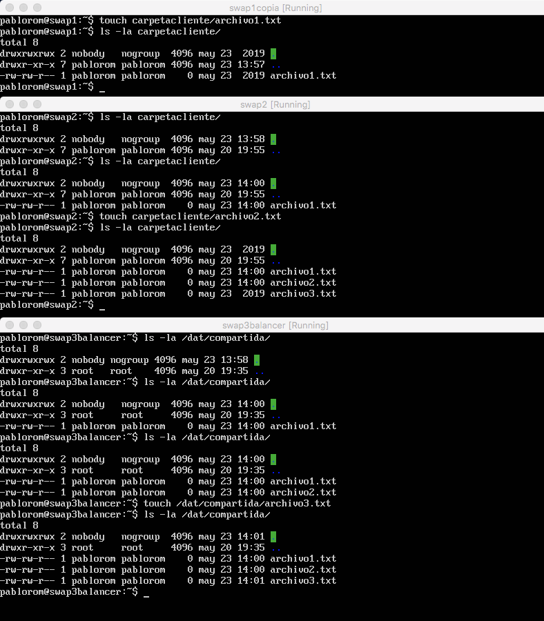

# SWAP - Práctica 6. Servidor de disco NFS

A continuación se detalla el proceso para:
 - Configurar una máquina como servidor de disco NFS y exportar una carpeta a
los clientes.
 - Montar en las máquinas cliente la carpeta exportada por el servidor.
 - Comprobar que la información que se escribe en una máquina en dicha carpeta
se ve actualizada en el resto de máquinas que comparten ese espacio.

## Configurar el servidor NFS

Instalaremos todas las herramientas necesarias en la maquina servidor (swap3):

```bash
pablorom@swap3balancer:~$ sudo apt-get install nfs-kernel-server nfs-common rpcbind
pablorom@swap3balancer:~$ mkdir /dat/compartida
pablorom@swap3balancer:~$ sudo chown nobody:nogroup /dat/compartida/ 
pablorom@swap3balancer:~$ sudo chmod -R 777 /dat/compartida/

```
Ahora tenemos que dar permisos de lectura y escritura a las maquinas clientes, añadiendo sus IP al fichero de configuración /etc/exports:
```bash
/dat/compartida/ 192.168.56.2(rw) 192.168.56.3(rw)
```
Y reiniciamos el servicio:
```bash
pablorom@swap3balancer:~$ sudo service nfs-kernel-server restart
```
## Configurar los clientes

En cada una de las máquinas clientes instalaremos los paquetes necesarios y crearemos el punto de montaje:

```bash
pablorom@swap1:~$ sudo apt-get install nfs-common rpcbind
pablorom@swap1:~$ cd /home/usuario
pablorom@swap1:~$ mkdir carpetacliente
pablorom@swap1:~$ chmod -R 777 carpetacliente

pablorom@swap2:~$ sudo apt-get install nfs-common rpcbind
pablorom@swap2:~$ cd /home/usuario
pablorom@swap2:~$ mkdir carpetacliente
pablorom@swap2:~$ chmod -R 777 carpetacliente
```
Y ahora montamos la carpeta remota en cada una de las carpetas cliente:
```bash
pablorom@swap1:~$ sudo mount 192.168.56.2:/dat/compartida carpetacliente
pablorom@swap2:~$ sudo mount 192.168.56.3:/dat/compartida carpetacliente
```


> (Podemos ver como desde cada máquina se lee, escribe y actualiza el contenido de la carpeta compartida)

Para automatizar el proceso de montado de la carpeta compartida, podemos añadir lo siguiente al fichero de configuración /etc/fstab:

```bash
//En swap1
192.168.56.4:/dat/compartida /home/usuario/carpetacliente/ nfs auto,noatime,nolock,bg,nfsvers=3,intr,tcp,actimeo=1800 0 0
//En swap2
192.168.56.4:/dat/compartida /home/usuario/carpetacliente/ nfs auto,noatime,nolock,bg,nfsvers=3,intr,tcp,actimeo=1800 0 0
```
